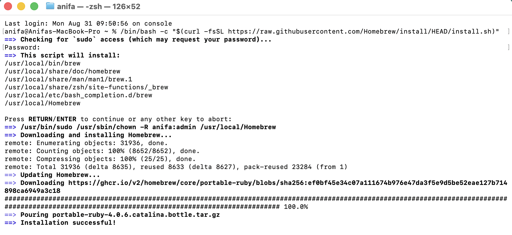
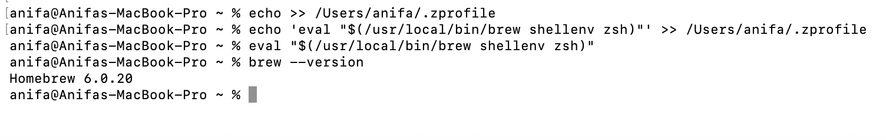
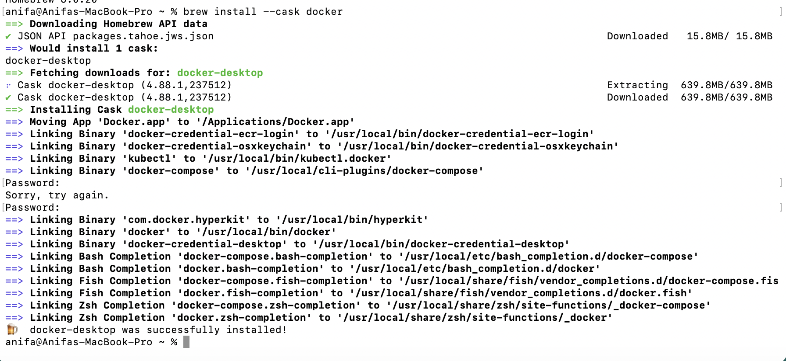
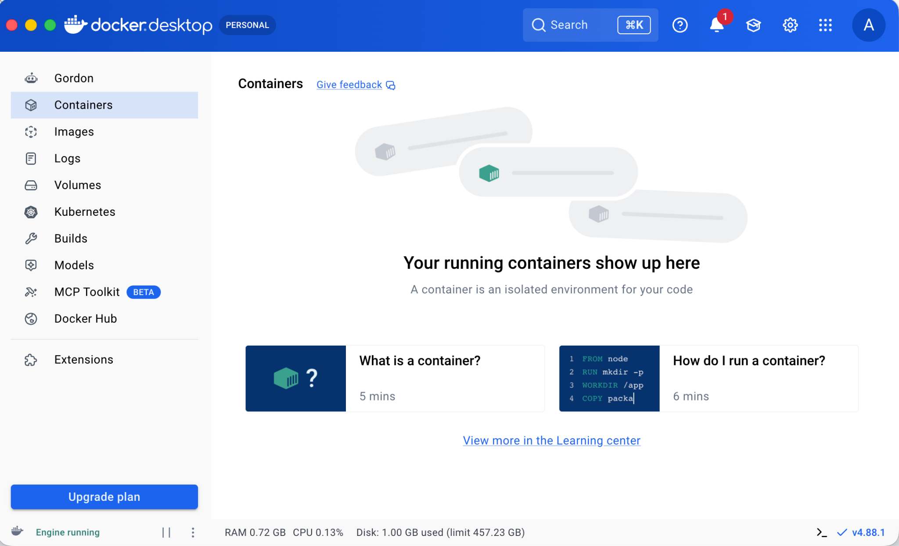
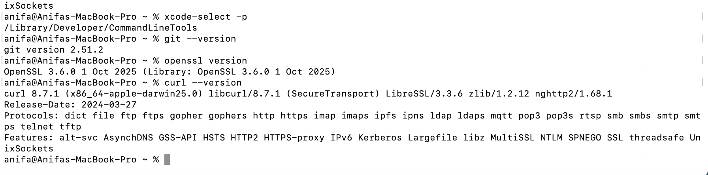
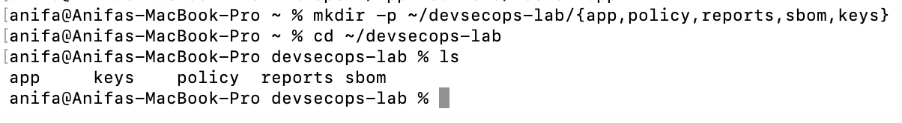
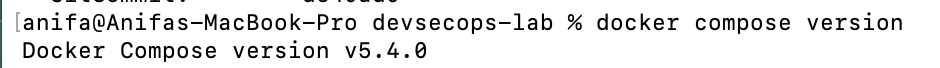
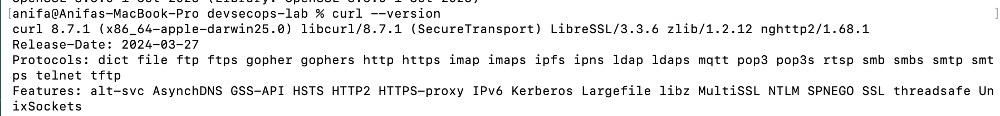

# Laporan Bab - 1

<div align="center">
  <h1 style="text-align: center;font-weight: bold">LAPORAN RESMI<br>WORKSHOP DEVOPS</h1>
  <h4 style="text-align: center;">Dosen Pengampu : Dr. Ferry Astika Saputra, S.T., M.Sc.</h4>
</div>
<br />
<div align="center">
  
  <h3 style="text-align: center;">Disusun Oleh : </h3>
  <p style="text-align: center;">
    <strong>Anifa Aulia Abdari (3126640053)</strong><br>
  </p>
  <h3 style="text-align: center;line-height: 1.5">Politeknik Elektronika Negeri Surabaya<br>Departemen Teknik Informatika Dan Komputer<br>Program Studi Teknik Informatika<br>Kelas B - StrLJ D4 Teknik Informatika<br>2026</h3>
  <hr><hr>
</div>

---

## 1. Tujuan Praktikum

1. Menyiapkan lingkungan kerja (*baseline*) di macOS dengan menginstal seluruh perangkat pendukung DevSecOps.
2. Memverifikasi keberhasilan instalasi Homebrew, Docker Desktop, dan Xcode Command Line Tools.
3. Merekam versi komponen laboratorium (Docker, Docker Compose, Git, OpenSSL, curl) sebagai *baseline* yang dapat direproduksi.
4. Memeriksa mekanisme keamanan yang tersedia pada Docker melalui `docker info`.
5. Menyusun *threat statement* awal yang mencakup aset, aktor ancaman, jalur serangan, dan dampak.

---

## 2. Alat dan Bahan

| No | Komponen | Keterangan |
| --- | --- | --- |
| 1 | macOS | Sistem operasi laboratorium |
| 2 | Homebrew | Package manager untuk instalasi tools di macOS |
| 3 | Docker Desktop | Runtime container untuk macOS |
| 4 | Xcode Command Line Tools | Menyediakan compiler dan git dasar di macOS |
| 5 | Git | Version control |
| 6 | OpenSSL | Utilitas kriptografi |
| 7 | curl | Klien HTTP untuk pengujian endpoint |
| 8 | Terminal | Eksekusi perintah |

---

## 3. Langkah Praktikum

### 3.1 Instalasi Prasyarat

**a. Instalasi Homebrew pada macOS**



*Gambar 1. Proses instalasi Homebrew pada macOS.*

Setelah instalasi selesai, path Homebrew ditambahkan ke shell profile dan diverifikasi keberhasilannya.



*Gambar 2. Penambahan path Homebrew dan verifikasi instalasi.*

**b. Instalasi Docker Desktop**



*Gambar 3. Tampilan Docker Desktop setelah berhasil diinstal.*



*Gambar 4. Docker Desktop dalam kondisi berjalan (running).*

**c. Verifikasi/Instalasi Xcode Command Line Tools**



*Gambar 5. Verifikasi instalasi Xcode Command Line Tools.*

### 3.2 Menjalankan Baseline Praktikum

**a. Memastikan Docker berjalan**

Docker dipastikan aktif dengan menjalankan:

```bash
open /Applications/Docker.app
```

**b. Membuat folder kerja**



*Gambar 6. Struktur folder kerja yang dibuat untuk praktikum.*

**c. Mengecek versi Docker**

```bash
docker version
```


*Gambar 7. Hasil pengecekan versi Docker.*

**d. Mengecek versi Docker Compose**

```bash
docker compose version
```



*Gambar 8. Hasil pengecekan versi Docker Compose.*

**e. Mengecek versi Git**

```bash
git --version
```


*Gambar 9. Hasil pengecekan versi Git.*

**f. Mengecek versi OpenSSL**

```bash
openssl version
```


*Gambar 10. Hasil pengecekan versi OpenSSL.*

**g. Mengecek versi curl**

```bash
curl --version
```



*Gambar 11. Hasil pengecekan versi curl.*

**h. Mengecek Security Options Docker**

```bash
docker info --format '{{json .SecurityOptions}}'
```


*Gambar 12. Keluaran SecurityOptions dari Docker.*

---

## 4. Hasil dan Pembahasan

### 4.1 Rekaman Baseline

| Komponen | Perintah | Versi Tercatat |
| --- | --- | --- |
| Homebrew | `brew --version` | *(lihat Gambar 1–2)* |
| Docker Desktop | `docker version` | *(lihat Gambar 7)* |
| Docker Compose | `docker compose version` | *(lihat Gambar 8)* |
| Git | `git --version` | *(lihat Gambar 9)* |
| OpenSSL | `openssl version` | *(lihat Gambar 10)* |
| curl | `curl --version` | *(lihat Gambar 11)* |

> Catatan: kolom "Versi Tercatat" perlu diisi manual sesuai angka yang tertera pada masing-masing gambar hasil praktikum.

### 4.2 Mekanisme Keamanan Host

Keluaran `docker info --format '{{json .SecurityOptions}}'` (Gambar 12) menunjukkan mekanisme keamanan yang **tersedia** pada Docker daemon di macOS. Hasil ini menjadi acuan awal sebelum konfigurasi *hardening* lebih lanjut diterapkan pada container.

### 4.3 Threat Statement

Aset yang dilindungi adalah *Docker daemon*, *image*, dan *container* yang dibangun, serta direktori kerja `reports`, `sbom`, dan `keys` yang menyimpan hasil pemindaian dan material kriptografi. Aktor ancaman yang relevan mencakup pengguna internal yang tidak sengaja memberikan akses berlebih pada *Docker socket*, maupun pihak eksternal yang memanfaatkan kerentanan pada *image container*.

Jalur serangan yang mungkin terjadi meliputi akses tidak sah ke *Docker socket* akibat permission yang longgar, penggunaan image dengan dependency yang memiliki celah keamanan (CVE), atau kebocoran *secret* dari folder `keys` bila tidak dijaga dengan baik. Apabila hal tersebut terjadi, dampaknya dapat berupa eskalasi hak akses ke level host, kebocoran data sensitif, hingga rusaknya integritas proses *delivery* software.

| Unsur | Isi |
| --- | --- |
| Aset | Docker daemon, image, container, serta folder `reports`, `sbom`, `keys` |
| Aktor ancaman | Pengguna internal dengan akses berlebih; pihak eksternal yang mengeksploitasi image rentan |
| Jalur serangan | Docker socket dengan permission longgar; dependency dengan CVE; kebocoran secret dari folder keys |
| Dampak | Eskalasi hak akses ke host, kebocoran data sensitif, rusaknya integritas delivery software |

---

## 5. Analisis Hasil

1. **Kesiapan lingkungan** — Seluruh prasyarat (Homebrew, Docker Desktop, Xcode CLT) berhasil terinstal dan terverifikasi, sehingga lingkungan siap digunakan untuk praktikum DevSecOps selanjutnya.
2. **Reproduksibilitas baseline** — Pencatatan versi Docker, Compose, Git, OpenSSL, dan curl memungkinkan hasil praktikum berikutnya ditelusuri ke kombinasi versi tool yang spesifik.
3. **Interpretasi SecurityOptions** — Mekanisme keamanan yang muncul pada `docker info` hanya menunjukkan fitur yang tersedia di host, bukan jaminan bahwa seluruh container sudah *hardened*.
4. **Kesadaran risiko sejak awal** — Threat statement yang disusun pada tahap ini menjadi dasar analisis risiko yang lebih mendalam pada praktikum berikutnya.

---

## 6. Evaluasi dan Latihan Mandiri

**1. Mengapa DevSecOps tidak dapat direduksi menjadi penambahan scanner pada pipeline?**

DevSecOps tidak bisa disederhanakan menjadi sekadar penambahan scanner, karena scanner hanyalah alat, bukan solusi menyeluruh. Tanpa perubahan proses kerja, temuan kerentanan hanya akan menumpuk tanpa ada yang menindaklanjuti dan keamanan tetap dianggap tanggung jawab tim security saja. DevSecOps yang efektif membutuhkan perubahan pada empat aspek sekaligus: teknologi (tooling), proses (tindak lanjut hasil scan), tata kelola (kewenangan approve/reject), dan budaya kerja (tanggung jawab bersama).

**2. Evidence apa yang membedakan klaim kontrol dari kontrol yang benar-benar terverifikasi?**

Klaim kontrol hanya berupa pernyataan tanpa bukti, misalnya asumsi "sudah aman karena pakai container". Kontrol terverifikasi didukung evidence konkret seperti hasil scan dengan timestamp, versi tool dan database vulnerability yang digunakan, konfigurasi keamanan yang benar-benar diperiksa (bukan diasumsikan), serta SBOM yang mencatat seluruh dependency. Intinya, evidence yang sah harus reproducible dan bisa diverifikasi ulang oleh pihak lain.

**3. Bagaimana shared responsibility memengaruhi ownership risiko dan tindak lanjut temuan?**

Shared responsibility membagi tanggung jawab keamanan antara developer, tim operasional, tim security, dan penyedia platform. Developer bertanggung jawab atas kerentanan di kodenya, operasional atas konfigurasi infrastruktur, dan security atas kebijakan serta validasi akhir. Tanpa pembagian yang jelas, temuan scan hanya menumpuk tanpa tindak lanjut. Dengan ownership yang jelas, setiap temuan bisa ditangani sesuai dengan pihak yang berwenang, misalnya developer memperbaiki kerentanan kritis dalam batas waktu tertentu.

---

## 7. Kesimpulan

1. Baseline laboratorium berhasil ditetapkan melalui instalasi Homebrew, Docker Desktop, dan Xcode Command Line Tools pada macOS.
2. Versi komponen (Docker, Compose, Git, OpenSSL, curl) berhasil direkam sebagai acuan yang dapat direproduksi pada praktikum berikutnya.
3. Keluaran `SecurityOptions` hanya menunjukkan mekanisme keamanan yang tersedia pada host/daemon, bukan bukti bahwa container telah *hardened*.
4. Threat statement awal yang disusun (aset, aktor ancaman, jalur serangan, dampak) menjadi dasar analisis risiko lebih lanjut.
5. Konsep DevSecOps ditegaskan sebagai perubahan menyeluruh pada teknologi, proses, tata kelola, dan budaya kerja — bukan sekadar penambahan scanner pada pipeline.
