# Bab 2 : Konsep Container dan Instalasi Docker

<div align="center">
  <h1 style="text-align: center;font-weight: bold">Praktikum 2<br>Containerization dan Docker</h1>
  <h4 style="text-align: center;">Dosen Pengampu : Dr. Ferry Astika Saputra, S.T., M.Sc.</h4>
</div>
<br />
<div align="center">
  
  <h3 style="text-align: center;">Disusun Oleh : </h3>
  <p style="text-align: center;">
    <strong>Anifa Aulia Abdari (3126640053)</strong><br>
  </p>
  <h3 style="text-align: center;line-height: 1.5">Politeknik Elektronika Negeri Surabaya<br>Departemen Teknik Informatika Dan Komputer<br>Program Studi Teknik Informatika<br>Kelas B - StrLJ D4 Teknik Informatika<br>2026</h3>
  <hr><hr>
</div>

---

## 1. Tujuan Praktikum

1. Memahami konsep dasar containerization dan perbedaannya dengan virtualisasi tradisional.
2. Memverifikasi kembali instalasi Docker Desktop dan Docker Compose.
3. Menjalankan container berbasis image resmi (Nginx dan Ubuntu).
4. Membangun *custom Docker image* menggunakan Dockerfile.
5. Melakukan troubleshooting terhadap kendala umum saat menjalankan container.

---

## 2. Alat dan Bahan

| No | Komponen | Keterangan |
| --- | --- | --- |
| 1 | macOS | Sistem operasi laboratorium |
| 2 | Docker Desktop | Runtime container |
| 3 | Docker Compose | Orkestrasi multi-container |
| 4 | Image `nginx:1.26` | Image resmi web server Nginx |
| 5 | Image `ubuntu` | Image resmi sistem operasi Ubuntu |
| 6 | Dockerfile | Berkas definisi custom image |
| 7 | Terminal | Eksekusi perintah |

---

## 3. Langkah Praktikum

### 3.1 Verifikasi Instalasi Docker

Karena instalasi Docker Desktop telah dilakukan pada praktikum sebelumnya, langkah pertama adalah memastikan Docker Desktop masih berjalan dengan baik.

**a. Memastikan Docker Desktop berjalan**

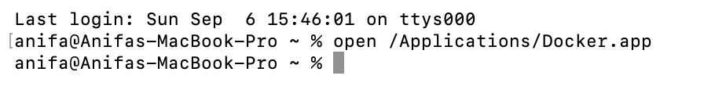

*Gambar 1. Command untuk memastikan Docker Desktop berjalan.*

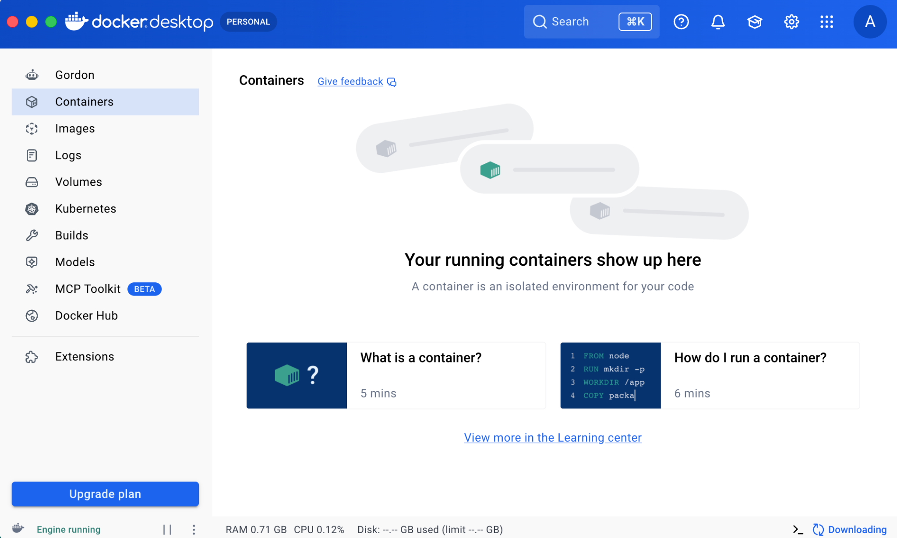

*Gambar 2. Docker Desktop dalam kondisi terbuka/running.*

**b. Verifikasi versi Docker**

```bash
docker version
```

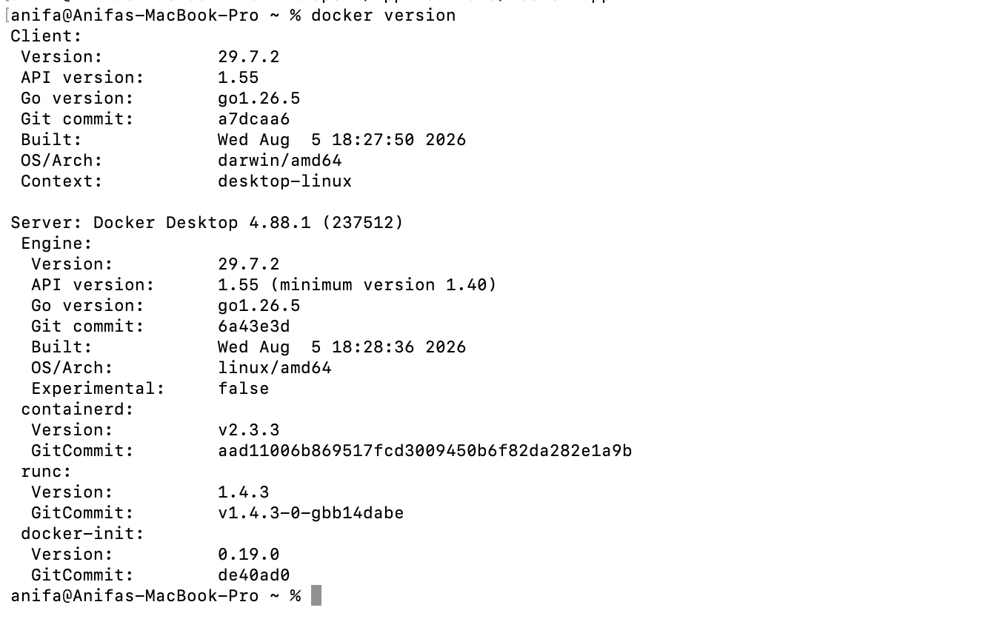

*Gambar 3. Hasil verifikasi versi Docker.*

**c. Verifikasi Docker Compose**

```bash
docker compose version
```

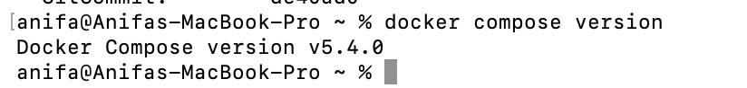

*Gambar 4. Hasil verifikasi versi Docker Compose.*

### 3.2 Menjalankan Container Nginx

**a. Membuat folder kerja**

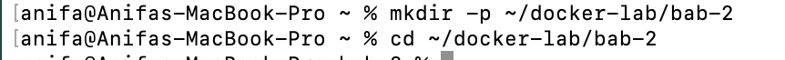

*Gambar 5. Pembuatan folder kerja untuk praktikum.*

**b. Mendownload image Nginx**

```bash
docker pull nginx:1.26
```

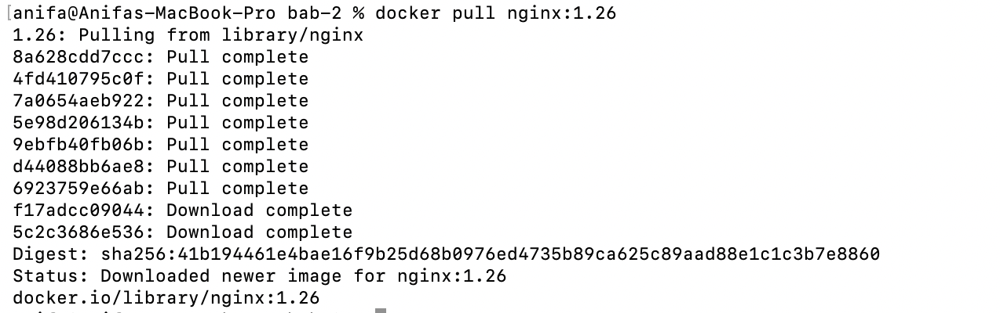

*Gambar 6. Proses download image `nginx:1.26`.*

**c. Menjalankan container Nginx**

```bash
docker run -d --name web-public -p 8080:80 nginx:1.26
```

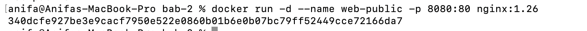

*Gambar 7. Container `web-public` berhasil dijalankan.*

**d. Mengecek container yang sedang berjalan**

```bash
docker ps
```

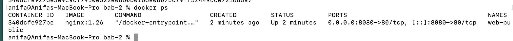

*Gambar 8. Daftar container yang sedang berjalan.*

**e. Mengecek log container**

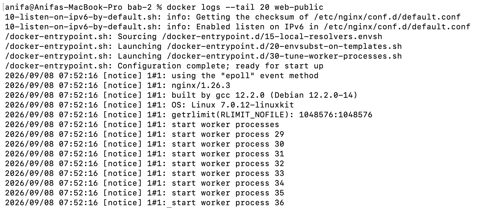

*Gambar 9. Log dari container Nginx.*

**f. Mengakses Nginx**

Nginx diakses melalui [http://localhost:8080/](http://localhost:8080/).

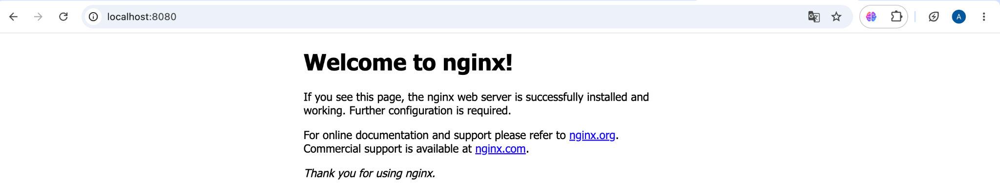

*Gambar 10. Container Nginx berhasil dijalankan dan port 80 pada container dipetakan ke port 8080 pada host.*

### 3.3 Menjalankan Container Ubuntu

**a. Membuat container Ubuntu interaktif**

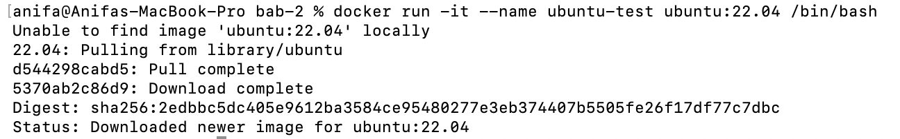

*Gambar 11. Pembuatan container Ubuntu secara interaktif.*

**b. Mengecek sistem operasi container**

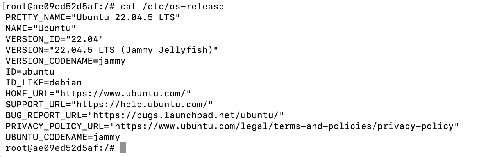

*Gambar 12. Verifikasi sistem operasi di dalam container.*

**c. Mengecek container Ubuntu**

Container `ubuntu-test` terlihat dalam daftar container pada gambar berikut.

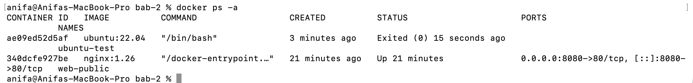

*Gambar 13. Container `ubuntu-test` pada daftar container.*

### 3.4 Membuat Custom Docker Image

**a. Membuat folder project**

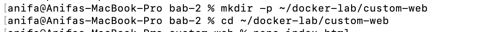

*Gambar 14. Pembuatan folder project untuk custom image.*

**b. Membuat file `index.html`**

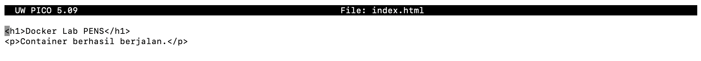

*Gambar 15. Pembuatan file `index.html`.*

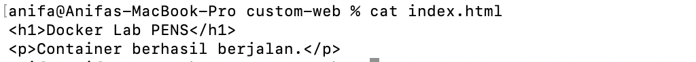

*Gambar 16. Isi file `index.html` yang ditambahkan.*

**c. Membuat Dockerfile**

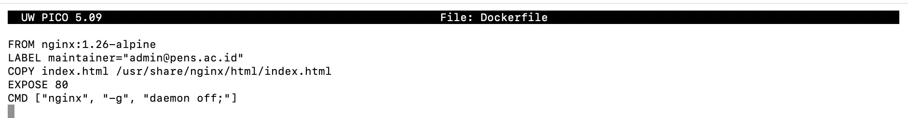

*Gambar 17. Pembuatan Dockerfile.*

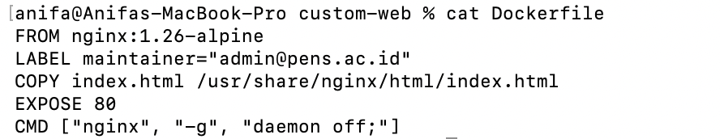

*Gambar 18. Isi Dockerfile.*

Dockerfile ini menggunakan Nginx Alpine sebagai base image, kemudian menyalin `index.html` ke direktori web Nginx.

**d. Build Docker image**

```bash
docker build -t pens-web:1.0 .
```

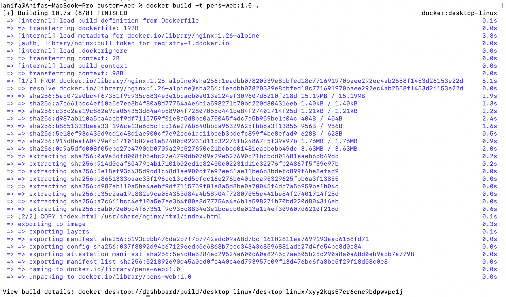

*Gambar 19. Proses build berhasil dan muncul image `pens-web:1.0`.*

**e. Mengecek image**

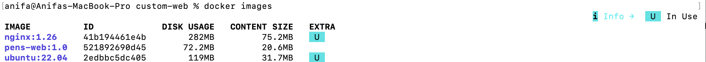

*Gambar 20. Daftar image yang tersedia, termasuk `pens-web:1.0`.*

**f. Menjalankan custom container**

```bash
docker run -d --name pens-app -p 9090:80 pens-web:1.0
```

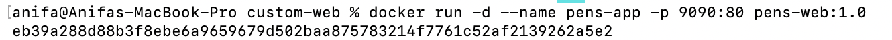

*Gambar 21. Container `pens-app` berhasil dijalankan.*

**g. Menguji custom web**

Pengujian dilakukan melalui [http://localhost:9090/](http://localhost:9090/).

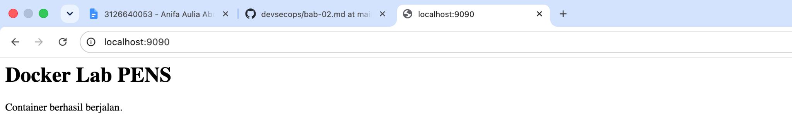

*Gambar 22. Custom image berhasil dibangun dan dijalankan.*

---

## 4. Hasil dan Pembahasan

### 4.1 Ringkasan Container yang Dijalankan

| Nama Container | Image | Port Mapping | Fungsi |
| --- | --- | --- | --- |
| `web-public` | `nginx:1.26` | 8080:80 | Web server Nginx resmi |
| `ubuntu-test` | `ubuntu` | - | Container interaktif untuk eksplorasi OS |
| `pens-app` | `pens-web:1.0` | 9090:80 | Web server dengan custom image |

### 4.2 Troubleshooting dan Analisis

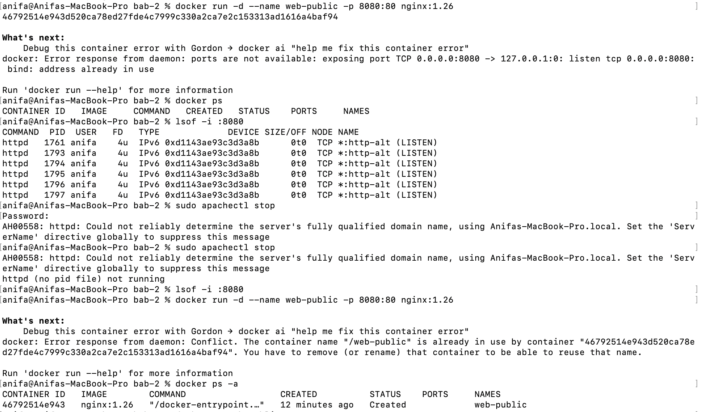

*Gambar 23. Kendala yang ditemui saat menjalankan web server.*

Pada saat menjalankan web server dengan Docker menggunakan image *nginx:1.26*, terdapat dua kendala. Pertama, *port 8080* pada host sedang digunakan oleh Apache (httpd), sehingga Docker tidak dapat melakukan binding ke port tersebut dan menampilkan pesan *bind: address already in use*. Masalah ini ditangani dengan menghentikan Apache menggunakan perintah *sudo apachectl stop*, kemudian memastikan kembali bahwa port 8080 sudah tidak digunakan.

Setelah port berhasil dibebaskan, muncul kendala kedua, yaitu konflik nama container *web-public*. Container tersebut sebenarnya sudah dibuat sebelumnya. Solusi yang dilakukan adalah menjalankan container yang sudah ada menggunakan perintah *docker start web-public*.

| Gejala | Penyebab | Solusi |
| --- | --- | --- |
| `bind: address already in use` pada port 8080 | Port sudah digunakan oleh Apache (httpd) | Menghentikan Apache dengan `sudo apachectl stop` |
| Konflik nama container `web-public` | Container dengan nama sama sudah pernah dibuat sebelumnya | Menjalankan container yang sudah ada dengan `docker start web-public` |

---

## 5. Analisis Hasil

1. **Reuse image resmi** — Menjalankan Nginx dan Ubuntu langsung dari image resmi menunjukkan bagaimana container mempercepat penyiapan lingkungan tanpa instalasi manual dari awal.
2. **Custom image sebagai layer tambahan** — Custom image `pens-web:1.0` dibangun di atas base image `nginx:1.26-alpine`, dengan menambahkan layer baru berisi `index.html`, menunjukkan prinsip *layering* pada Docker image.
3. **Isolasi port dan penamaan container** — Konflik port dan nama container yang ditemukan menegaskan pentingnya manajemen port dan penamaan container yang konsisten pada lingkungan dengan banyak service.
4. **Reproduksibilitas** — Penggunaan tag versi spesifik (`nginx:1.26`) alih-alih `latest` memastikan hasil deployment yang konsisten di berbagai waktu.

---

## 6. Evaluasi dan Latihan Mandiri

**1. Mengapa penggunaan tag latest tidak dianjurkan untuk deployment yang harus reproducible?**

Karena tag *latest* dapat berubah ketika image diperbarui. Akibatnya, deployment yang dilakukan pada waktu berbeda bisa menggunakan versi image yang berbeda. Sebaiknya gunakan versi yang spesifik agar hasil deployment tetap konsisten.

**2. Jelaskan peran containerd dan runc dalam arsitektur Docker.**

*Containerd* bertugas mengelola lifecycle container, seperti membuat, menjalankan, dan menghentikan container. Sementara itu, *runc* bertugas menjalankan container berdasarkan standar OCI dan berinteraksi langsung dengan fitur kernel Linux.

**3. Apa konsekuensi keamanan dari memasukkan user ke grup Docker?**

User yang masuk ke grup Docker dapat menjalankan perintah Docker tanpa *sudo*. Namun, akses tersebut pada dasarnya dapat memberikan hak istimewa yang setara dengan root, sehingga jika akun tersebut disalahgunakan, dapat membahayakan keamanan seluruh sistem.

**4. Bandingkan layer image nginx:1.26-alpine dan image custom yang dibuat.**

*nginx:1.26-alpine* merupakan base image yang berisi Nginx dan Alpine Linux. Image custom dibuat menggunakan image tersebut sebagai dasar, kemudian ditambahkan layer baru yang berisi file `index.html` sesuai kebutuhan aplikasi.

**5. Kapan sebaiknya memilih VM daripada container?**

VM sebaiknya dipilih ketika membutuhkan isolasi yang lebih kuat, menjalankan sistem operasi atau kernel yang berbeda, atau membutuhkan lingkungan virtual yang benar-benar terpisah. Container lebih cocok untuk aplikasi yang membutuhkan proses deployment cepat dan ringan.

---

## 7. Kesimpulan

1. Docker Desktop dan Docker Compose berhasil diverifikasi kembali dan berjalan dengan baik pada praktikum ini.
2. Container berbasis image resmi (Nginx dan Ubuntu) berhasil dijalankan, menunjukkan kemudahan containerization dibandingkan instalasi manual.
3. Custom Docker image (`pens-web:1.0`) berhasil dibangun menggunakan Dockerfile berbasis Nginx Alpine, membuktikan konsep *layering* pada image Docker.
4. Kendala port yang bentrok dan konflik nama container berhasil diatasi, menegaskan pentingnya manajemen resource pada lingkungan container.
5. Pemilihan container atau VM bergantung pada kebutuhan isolasi dan portabilitas aplikasi yang dijalankan.
