# Bab 3 : Docker Network, Volume, Bind Mount, tmpfs, dan Compose

<div align="center">
  <h1 style="text-align: center;font-weight: bold">Praktikum 3<br>Containerization dan Docker</h1>
  <h4 style="text-align: center;">Dosen Pengampu : Dr. Ferry Astika Saputra, S.T., M.Sc.</h4>
</div>
<br />
<div align="center">
  
  <h3 style="text-align: center;">Disusun Oleh : </h3>
  <p style="text-align: center;">
    <strong>Anifa Aulia Abdari (3126640053)</strong><br>
  </p>
  <h3 style="text-align: center;line-height: 1.5">Politeknik Elektronika Negeri Surabaya<br>Departemen Teknik Informatika Dan Komputer<br>Program Studi Teknik Informatika<br>Kelas B - StrLJ D4 Teknik Informatika<br>2026</h3>
  <hr><hr>
</div>

---

## 1. Tujuan Praktikum

1. Memahami konsep *user-defined bridge network* dan mekanisme *name resolution* antar container.
2. Memahami perilaku *named volume*, termasuk pembuktian *lifecycle*-nya yang independen dari container serta proses backup datanya.
3. Membangun arsitektur multi-container tiga lapis (Nginx - Flask - PostgreSQL) menggunakan Docker Compose.
4. Menerapkan pemisahan network (*frontend* dan *backend*) serta *healthcheck* pada *depends_on* agar urutan startup service terkendali.
5. Menganalisis risiko keamanan *bind mount* serta strategi backup volume untuk database produksi.

---

## 2. Alat dan Bahan

| No | Komponen | Keterangan |
| --- | --- | --- |
| 1 | macOS | Sistem operasi laboratorium |
| 2 | Docker Desktop | Runtime container |
| 3 | Docker Compose | Orkestrasi multi-container |
| 4 | Image `nginx:alpine` | Web server pada network `lab-net` dan pada service `web` |
| 5 | Image `alpine:3.20` | Container uji untuk penulisan dan backup volume |
| 6 | Image `postgres:16-alpine` | Database pada service `db` |
| 7 | `docker-compose.yml` | Berkas definisi arsitektur tiga lapis (web, app, db) |
| 8 | Terminal | Eksekusi perintah |

---

## 3. Langkah Praktikum

### 3.1 User-Defined Bridge Network

Pada bagian ini, dibuat sebuah *user-defined bridge network* untuk menghubungkan dua container dan membuktikan bahwa keduanya dapat saling melakukan resolusi nama (*name resolution*) tanpa perlu mengetahui alamat IP satu sama lain.

**a. Membuat user-defined bridge network dengan subnet kustom**

```bash
docker network create --driver bridge --subnet 172.20.0.0/16 lab-net
```

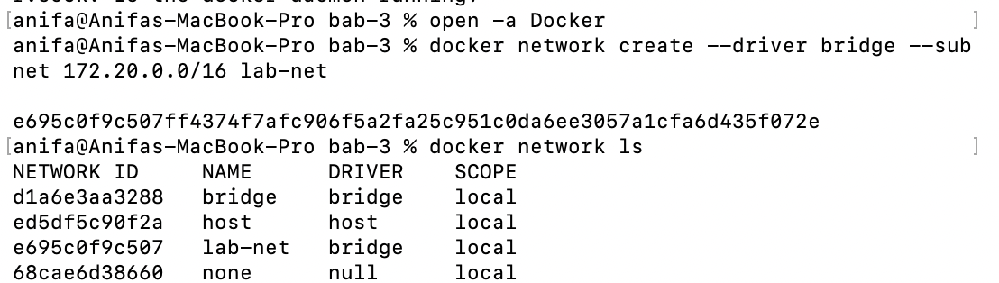

*Gambar 1. Pembuatan network `lab-net` dan verifikasi melalui `docker network ls`.*

**b. Menjalankan dua container (server-a dan server-b) pada network lab-net**

```bash
docker run -d --name server-a --network lab-net nginx:alpine
docker run -d --name server-b --network lab-net nginx:alpine
```

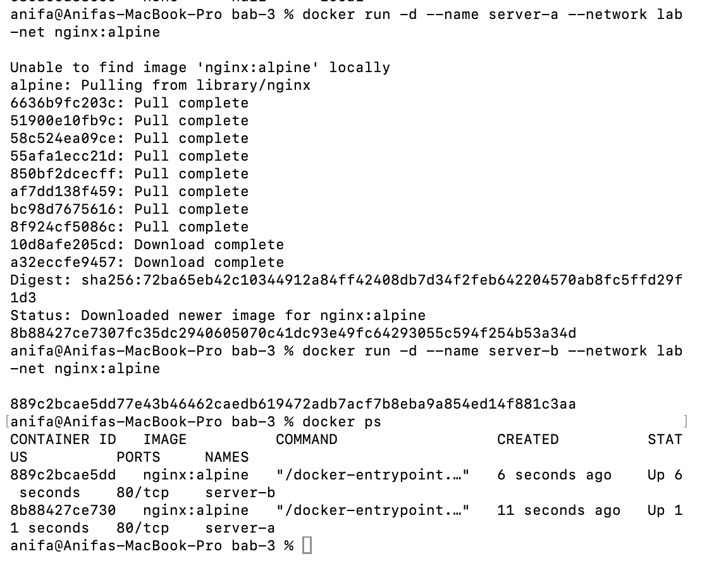

*Gambar 2. Container `server-a` dan `server-b` berhasil dijalankan pada network `lab-net`, terverifikasi melalui `docker ps`.*

**c. Menguji name resolution antar container dengan ping berdasarkan nama container**

```bash
docker exec server-a ping -c 3 server-b
```

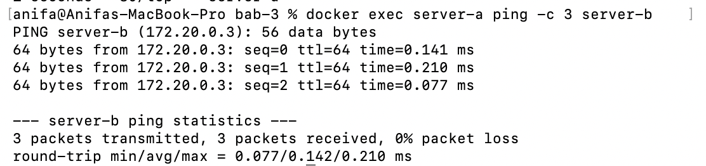

*Gambar 3. Hasil ping menunjukkan `server-a` berhasil menjangkau `server-b` hanya dengan menyebut namanya.*

Hasil ping menunjukkan `server-a` berhasil menjangkau `server-b` hanya dengan menyebut namanya, tanpa perlu mengetahui alamat IP-nya terlebih dahulu, artinya Docker berhasil melakukan resolusi nama (*name resolution*) secara otomatis melalui DNS internal pada *user-defined bridge network*. Ini berbeda dengan *default bridge*, yang tidak menyediakan DNS otomatis sehingga antar container hanya bisa saling terhubung menggunakan alamat IP yang bisa berubah setiap kali container dibuat ulang.

**d. Membersihkan container setelah pengujian selesai**

```bash
docker rm -f server-a server-b
```

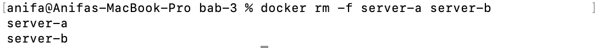

*Gambar 4. Container `server-a` dan `server-b` dihapus setelah pengujian selesai.*

### 3.2 Volume Backup dan Restore

Bagian ini menguji perilaku *named volume*: apakah data yang ditulis oleh satu container tetap ada meski container tersebut sudah dihapus, dan bagaimana melakukan backup data volume ke dalam berkas arsip.

**a. Membuat named volume dan container writer yang menulis timestamp setiap 5 detik**

```bash
docker volume create data-vol
docker run -d --name writer -v data-vol:/app/data alpine:3.20 \
  sh -c "while true; do date >> /app/data/log.txt; sleep 5; done"
```

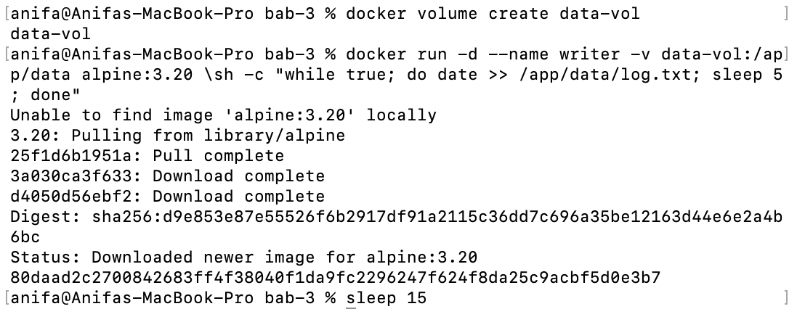

*Gambar 5. Pembuatan volume `data-vol` dan container `writer` yang menulis timestamp secara berkala.*

**b. Menghapus container writer, lalu membuktikan data tetap ada di volume**

```bash
docker rm -f writer
docker run --rm -v data-vol:/data alpine:3.20 cat /data/log.txt
```

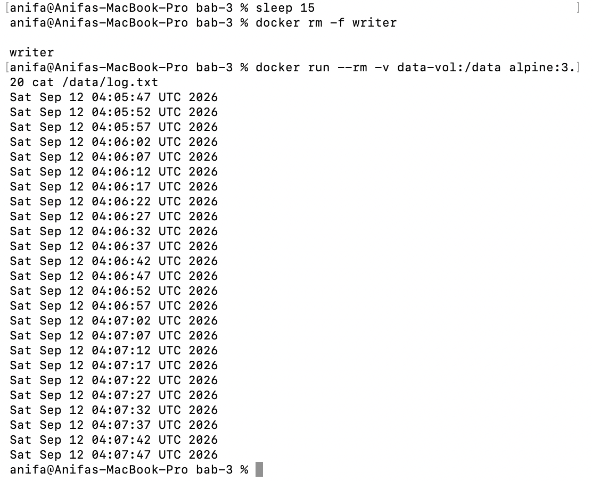

*Gambar 6. Baris-baris timestamp pada `log.txt` masih dapat terbaca meskipun container `writer` sudah dihapus.*

Baris-baris timestamp pada `log.txt` masih dapat terbaca meskipun container `writer` sudah dihapus dengan `docker rm -f`. Ini membuktikan bahwa data pada *named volume* tidak ikut hilang bersama container yang membuatnya, volume memiliki *lifecycle* sendiri yang independen dari container, sehingga data tetap tersimpan dan bisa diakses oleh container lain yang me-*mount* volume yang sama.

**c. Melakukan backup isi volume ke berkas tar.gz di host**

```bash
docker run --rm -v data-vol:/source:ro -v $(pwd):/backup alpine:3.20 \
  tar czf /backup/data-vol-backup.tar.gz -C /source .
```

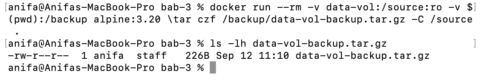

*Gambar 7. Proses backup isi volume `data-vol` ke berkas `data-vol-backup.tar.gz` di host.*

Volume `/source` dipasang dengan opsi *read-only*, karena proses backup hanya perlu membaca data, bukan mengubahnya, sesuai prinsip *least privilege* pada *mount*.

### 3.3 Compose Multi-Container Nginx-Flask-PostgreSQL

Bagian ini menyusun aplikasi tiga lapis (web, app, db) menggunakan Docker Compose, dengan network terpisah untuk *frontend* dan *backend*, *named volume* untuk persistensi database, serta *healthcheck* agar service `app` menunggu database benar-benar siap sebelum dijalankan.

**a. Menyusun berkas docker-compose.yml**

Berkas disusun sesuai arsitektur tiga lapis: `web` pada network `frontend`, `app` pada network `frontend` dan `backend`, serta `db` pada network `backend` dengan *healthcheck* `pg_isready`.

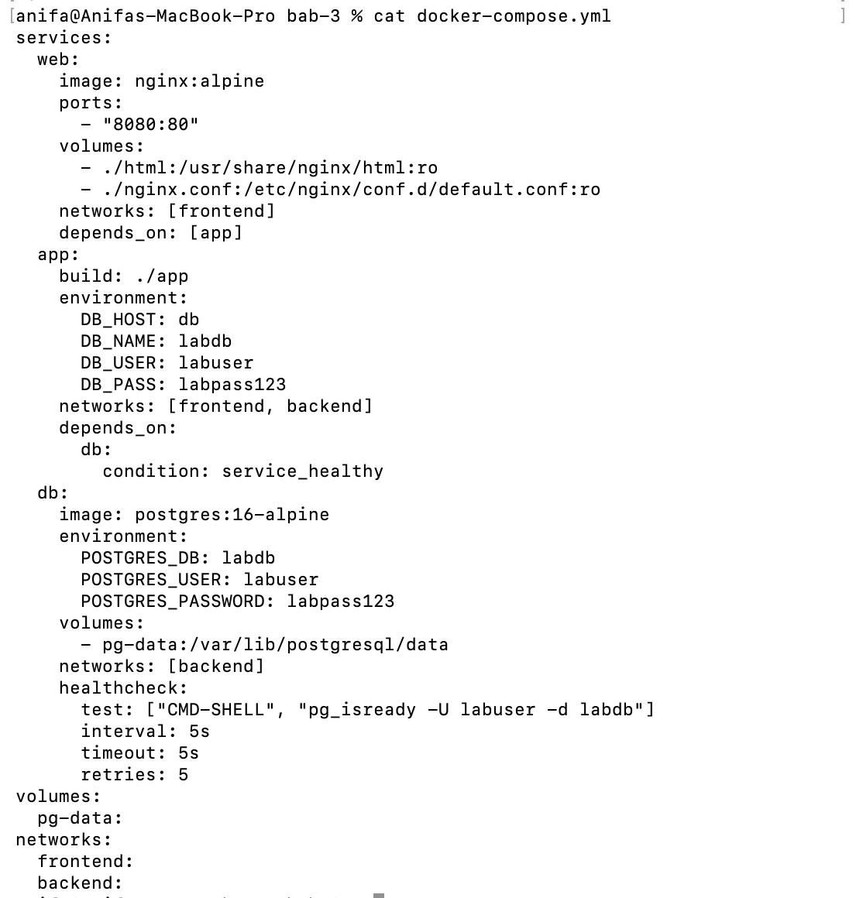

*Gambar 8. Isi berkas `docker-compose.yml` untuk arsitektur tiga lapis (web, app, db).*

**b. Menjalankan seluruh stack di background**

```bash
docker compose up -d
```

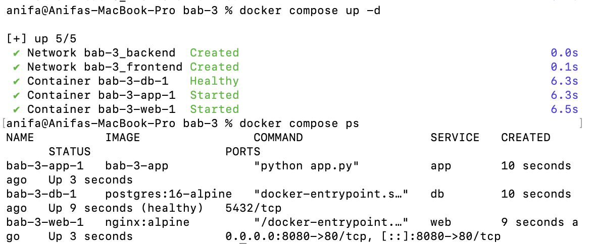

*Gambar 9. Seluruh service (`web`, `app`, `db`) berhasil dijalankan melalui `docker compose up -d`.*

**c. Memverifikasi status seluruh service dan memastikan db berstatus healthy sebelum app berjalan**

```bash
docker compose ps
```


*Gambar 10. Status seluruh service pada `docker compose ps`, service `db` berstatus healthy sebelum `app` dijalankan.*

**d. Menguji akses aplikasi melalui reverse proxy Nginx**

```bash
curl -v http://localhost:8080/
curl -v http://localhost:8080/api/health
```

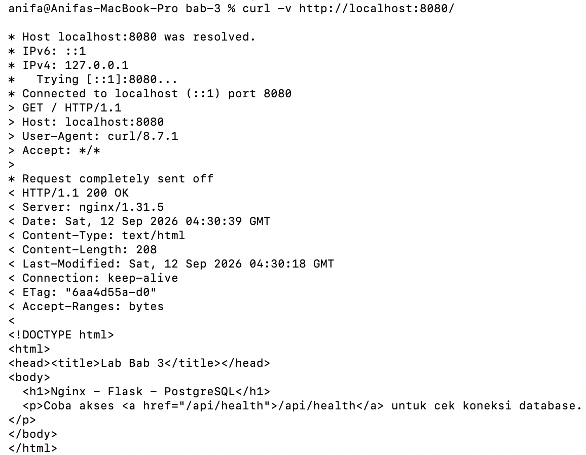

*Gambar 11. Hasil `curl` ke `http://localhost:8080/` menampilkan halaman utama aplikasi.*

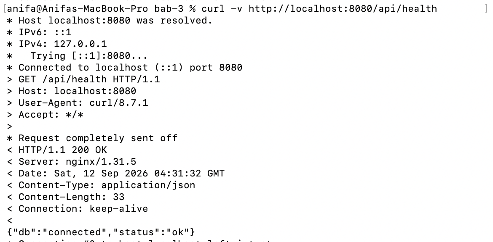

*Gambar 12. Hasil `curl` ke `/api/health` menunjukkan status `ok` dengan koneksi database berhasil.*

Endpoint `/api/health` mengembalikan status `ok` dengan `db: connected`, yang membuktikan aplikasi Flask berhasil terhubung ke PostgreSQL melalui network `backend`. Urutan startup `web` → `app` → `db` juga terbukti dari status pada `docker compose ps`, di mana service `db` baru dianggap *healthy* setelah `pg_isready` berhasil, dan barulah service `app` dijalankan sesuai kondisi `service_healthy` pada `depends_on`, sehingga `app` tidak pernah mencoba *connect* ke database sebelum database benar-benar siap menerima koneksi.

---

## 4. Hasil dan Pembahasan

### 4.1 Ringkasan Konfigurasi

| Komponen | Konfigurasi | Fungsi |
| --- | --- | --- |
| Network `lab-net` | `driver: bridge`, `subnet: 172.20.0.0/16` | Resolusi nama otomatis antar container `server-a` dan `server-b` |
| Volume `data-vol` | *named volume* | Persistensi data `log.txt` lintas container |
| Network `frontend` | `driver: bridge` (Compose) | Menghubungkan `web` dan `app` |
| Network `backend` | `driver: bridge` (Compose) | Menghubungkan `app` dan `db`, terisolasi dari `web` |
| Volume `pg-data` | *named volume* | Persistensi data PostgreSQL |
| Healthcheck `db` | `pg_isready -U labuser -d labdb` | Menunda startup `app` hingga `db` benar-benar siap |

### 4.2 Catatan Pelaksanaan

Tidak ditemukan kendala teknis yang berarti selama praktikum ini. Seluruh perintah (pembuatan network, pengujian *name resolution*, penulisan dan backup volume, hingga `docker compose up -d`) berjalan sesuai yang diharapkan, dan urutan startup `db` → `app` → `web` pada Compose sesuai dengan kondisi `service_healthy` yang didefinisikan pada `depends_on`.

---

## 5. Analisis Hasil

1. **Name resolution otomatis pada user-defined bridge** — Container yang tergabung dalam network `lab-net` dapat saling terhubung hanya dengan menyebut nama container, membuktikan adanya DNS internal Docker yang tidak tersedia pada *default bridge*.
2. **Lifecycle volume independen dari container** — Data pada `data-vol` tetap tersimpan meskipun container `writer` yang menulisnya sudah dihapus, menegaskan bahwa volume memiliki siklus hidup terpisah dari container yang memakainya.
3. **Prinsip least privilege pada mount** — Mount `/source:ro` pada proses backup menunjukkan penerapan akses baca saja ketika container tidak perlu menulis ke path tersebut, mengurangi risiko perubahan data yang tidak disengaja.
4. **Isolasi network pada arsitektur multi-container** — Pemisahan network `frontend` dan `backend` membatasi service `web` agar tidak dapat mengakses `db` secara langsung, sehingga hanya `app` yang menjembatani kedua sisi.
5. **Startup terkendali dengan healthcheck** — Penggunaan `condition: service_healthy` pada `depends_on` memastikan `app` menunggu `db` benar-benar siap (bukan sekadar container-nya berjalan) sebelum mencoba melakukan koneksi.

---

## 6. Evaluasi dan Latihan Mandiri

**1. Mengapa user-defined bridge lebih baik daripada default bridge untuk multi-container app?**

*Default bridge* tidak menyediakan DNS internal, sehingga container hanya dapat saling terhubung melalui alamat IP yang dapat berubah setiap kali container dibuat ulang. *User-defined bridge* menyediakan resolusi nama otomatis berdasarkan nama atau alias container, sehingga service dapat saling memanggil menggunakan nama yang stabil, serta menawarkan isolasi jaringan yang lebih baik karena hanya container yang sengaja digabungkan ke network tersebut yang dapat saling berkomunikasi.

**2. Apa risiko bind mount terhadap keamanan host?**

*Bind mount* memberi container akses langsung ke path pada *filesystem* host, dan secara default akses tersebut bersifat tulis (*read-write*). Artinya proses di dalam container berpotensi mengubah atau menghapus file host apabila container tersebut disusupi atau kodenya bermasalah. Selain itu, *bind mount* membuat *deployment* bergantung pada struktur direktori dan *permission* host, sehingga kurang portabel. Risiko ini dapat dikurangi dengan memasang *mount* sebagai *read-only*, ketika container tidak perlu menulis ke path tersebut.

**3. Apa perbedaan docker compose down dan docker compose down -v?**

`docker compose down` menghentikan dan menghapus seluruh container beserta network milik project, tetapi *named volume* yang dipakai tetap dipertahankan sehingga data di dalamnya tidak hilang. `docker compose down -v` melakukan hal yang sama, ditambah menghapus volume yang terkait dengan project tersebut; perintah ini bersifat destruktif dan dapat menghilangkan data secara permanen apabila dijalankan tanpa memastikan lebih dulu bahwa data tersebut sudah tidak dibutuhkan atau sudah di-*backup*.

**4. Kapan depends_on dengan healthcheck lebih tepat daripada depends_on biasa?**

`depends_on` biasa hanya mengatur urutan pembuatan container, bukan kesiapan layanan di dalamnya — sebuah database bisa saja prosesnya sudah berjalan padahal masih dalam tahap inisialisasi atau migrasi data, sehingga koneksi awal dari aplikasi dapat gagal. Menambahkan `condition: service_healthy` membuat Compose menunggu hingga *healthcheck* pada service dependency benar-benar melaporkan status sehat sebelum service yang bergantung padanya dijalankan. Pendekatan ini lebih tepat digunakan ketika dependency memerlukan waktu startup yang tidak instan, seperti database atau *message broker*, meskipun aplikasi tetap sebaiknya memiliki *retry* dengan *backoff* sendiri karena dependency bisa saja gagal kembali setelah *healthcheck* awal lolos.

**5. Bagaimana strategi backup volume untuk database produksi?**

Strategi backup volume database produksi sebaiknya tidak hanya mengandalkan *named volume* sebagai bentuk persistensi, karena volume tetap dapat terhapus atau korup. Backup idealnya dilakukan melalui mekanisme yang konsisten secara aplikasi, misalnya *dump* database (seperti `pg_dump` untuk PostgreSQL) yang dijalankan terjadwal, hasilnya disimpan di lokasi terpisah dari host asal, diberi kebijakan retensi dan enkripsi, serta dipantau kapasitasnya. Proses restore juga perlu diuji secara berkala untuk memastikan backup yang tersimpan benar-benar dapat dipulihkan saat dibutuhkan, bukan hanya diasumsikan valid.

---

## 7. Kesimpulan

1. *User-defined bridge network* (`lab-net`) berhasil dibuat dan terbukti menyediakan *name resolution* otomatis antar container tanpa perlu mengetahui alamat IP masing-masing.
2. *Named volume* (`data-vol`) terbukti memiliki *lifecycle* independen dari container: data tetap tersimpan meskipun container penulisnya sudah dihapus, dan berhasil di-*backup* ke berkas `tar.gz` menggunakan *mount read-only*.
3. Arsitektur multi-container tiga lapis (Nginx - Flask - PostgreSQL) berhasil dijalankan menggunakan Docker Compose, dengan network `frontend` dan `backend` yang terpisah untuk mengisolasi trafik.
4. *Healthcheck* pada service `db` (`pg_isready`) yang dikombinasikan dengan `condition: service_healthy` pada `depends_on` terbukti mengendalikan urutan startup, sehingga `app` hanya terhubung ke database setelah benar-benar siap.
5. Pengujian melalui endpoint `/` dan `/api/health` mengonfirmasi bahwa seluruh service saling terhubung dengan benar, dari `web` sebagai *reverse proxy*, `app` sebagai backend Flask, hingga `db` sebagai database PostgreSQL.
