# Bab 3: Docker Network, Volume, Bind Mount, tmpfs, dan Compose
<div align="center">
  
  <h3 style="text-align: center;">Disusun Oleh : </h3>
  <p style="text-align: center;">
    <strong>Anifa Aulia Abdari (3126640053)</strong><br>
    Tanggal pelaksanaan : 23 September 2026<br>
  </p>
  <h3 style="text-align: center;line-height: 1.5">Politeknik Elektronika Negeri Surabaya<br>Departemen Teknik Informatika Dan Komputer<br>Program Studi Teknik Informatika<br>Kelas B - StrLJ D4 Teknik Informatika<br>2026</h3>
  <hr><hr>
</div>

---

## 1. Tujuan Praktikum

Praktikum Bab 3 bertujuan membangun pemahaman praktis atas tiga mekanisme inti Docker yang saling melengkapi: jaringan (*network*), penyimpanan (*volume*, *bind mount*, *tmpfs*), dan orkestrasi multi-container melalui Compose. Secara rinci, praktikum ini bertujuan untuk:

1. Membuat *user-defined bridge network* dan membuktikan mekanisme *name resolution* antar-container berdasarkan nama, bukan alamat IP.
2. Menguji perilaku *named volume*, khususnya *lifecycle*-nya yang independen dari container, serta melakukan backup datanya ke berkas arsip.
3. Menyusun dan menjalankan arsitektur aplikasi tiga lapis (Nginx sebagai *reverse proxy*, Flask sebagai *backend*, PostgreSQL sebagai *database*) menggunakan Docker Compose.
4. Menerapkan pemisahan network *frontend*/*backend* serta *health check* pada `depends_on` agar urutan *startup* antar-service terkendali.
5. Menerapkan praktik keamanan dasar pada konfigurasi Compose: membatasi publikasi port ke *loopback* (`127.0.0.1`) dan menjalankan container aplikasi sebagai pengguna *non-root*.

---

## 2. Dasar Teori Singkat

Jaringan container pada Docker tidak sekadar memberi alamat IP, melainkan membentuk graf keterjangkauan yang menentukan komponen mana yang dapat saling berkomunikasi. *Default bridge network* menyediakan konektivitas dasar tetapi tidak memiliki resolusi nama otomatis, sehingga container harus saling mengetahui alamat IP satu sama lain, sesuatu yang tidak stabil karena alamat IP dapat berubah setiap kali container dibuat ulang. *User-defined bridge network* menutup celah ini dengan menyediakan DNS internal berbasis nama atau alias container, sehingga identitas logis service menjadi lebih stabil dibandingkan dengan alamat IP.

Untuk persistensi data, Docker menyediakan tiga mekanisme dengan karakteristik berbeda:

| Mekanisme | Karakteristik | Penggunaan |
| --- | --- | --- |
| Named volume | Dikelola oleh Docker Engine dan bertahan melampaui *lifecycle* container | Data yang harus persisten, seperti data database |
| Bind mount | Memetakan path host langsung ke dalam container; secara default container memiliki akses tulis ke filesystem host sehingga perlu dibatasi dengan opsi *read-only* bila tidak diperlukan | *Source code* dan konfigurasi pengembangan |
| tmpfs | Menyimpan data di memori host dan otomatis hilang saat container berhenti | *Cache* atau data sensitif yang tidak boleh persisten |

Docker Compose menyatakan model aplikasi multi-container secara deklaratif dalam satu berkas YAML. Compose memungkinkan definisi *service*, *network*, *volume*, *environment*, dan *healthcheck* dalam satu unit yang dapat direproduksi. Elemen `depends_on` dengan `condition: service_healthy` memastikan sebuah service tidak dijalankan sebelum dependency-nya benar-benar siap menerima koneksi, berbeda dengan `depends_on` biasa yang hanya mengatur urutan pembuatan container tanpa memverifikasi kesiapan layanan di dalamnya.

---

## 3. Alat dan Bahan

| No | Komponen | Keterangan |
| --- | --- | --- |
| 1 | Sistem operasi | macOS |
| 2 | Docker Desktop | Docker version 29.7.2 |
| 3 | Docker Compose | v2 (plugin bawaan Docker Desktop) |
| 4 | Image `nginx:alpine` | Web server pada network lab-net dan service `web` |
| 5 | Image `alpine:3.20` | Container uji untuk penulisan dan backup volume |
| 6 | Image `postgres:16-alpine` | Database pada service `db` |
| 7 | Image `python:3.12-slim` | Image dasar untuk service `app` (Flask + gunicorn) |
| 8 | Direktori kerja | `~/docker-lab/bab-3` |
| 9 | Berkas utama | `compose.yaml`, `nginx.conf`, `app/Dockerfile`, `app/requirements.txt`, `app/app.py`, `html/index.html` |

---

## 4. Langkah Praktikum

### 4.1 Menyiapkan Struktur Direktori dan Berkas Pendukung Compose

Struktur direktori praktikum dibuat dengan perintah berikut:

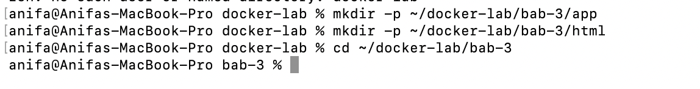

*Gambar 1. Pembuatan struktur direktori bab-3.*

Direktori `bab-3` digunakan sebagai direktori utama praktikum. Folder `app` berisi Dockerfile dan *source code* Flask, sedangkan folder `html` digunakan untuk menyimpan halaman HTML yang akan digunakan oleh Nginx.

### 4.2 Membuat File compose.yaml

File `compose.yaml` dibuat sebagai konfigurasi utama untuk menjalankan seluruh service menggunakan Docker Compose.

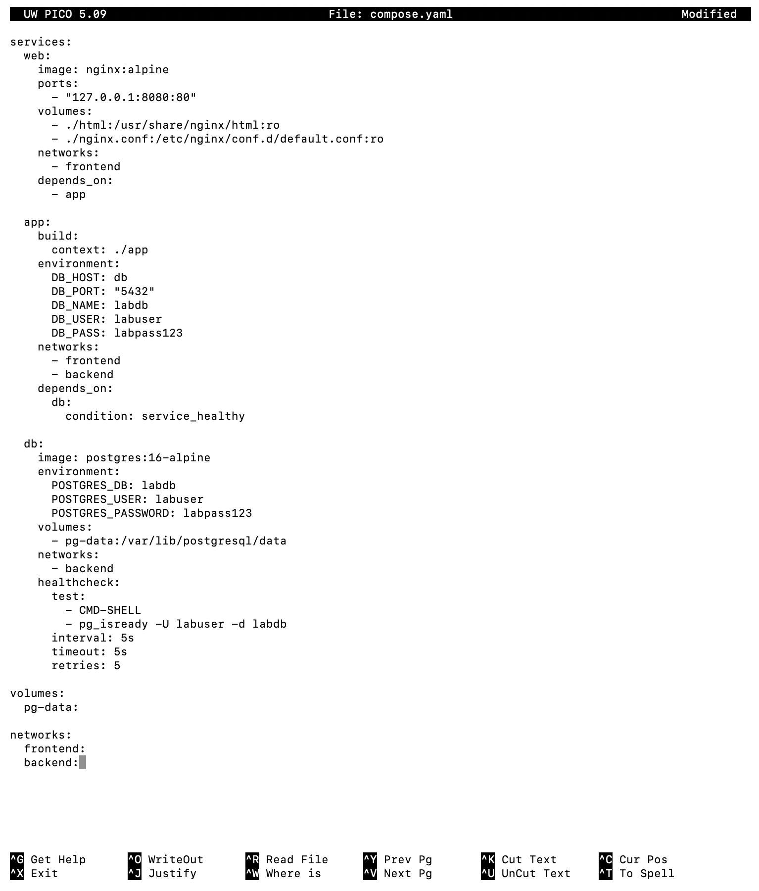

*Gambar 2. Isi file `compose.yaml`.*

Docker Compose digunakan untuk mengatur beberapa container sekaligus. Pada praktikum ini, ketiga service tersebut saling terhubung melalui network Docker. Service `web` terhubung ke network `frontend`, service `app` terhubung ke `frontend` dan `backend`, sedangkan service `db` hanya terhubung ke `backend`.

### 4.3 Membuat Requirements Flask

File `requirements.txt` digunakan untuk menentukan *library* Python yang diperlukan oleh aplikasi Flask.

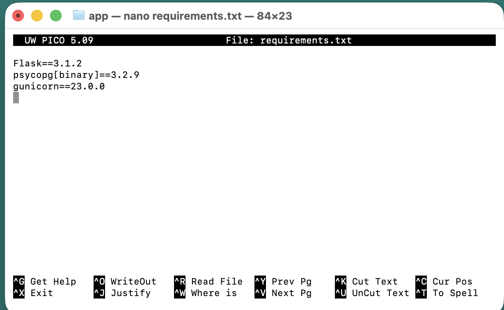

*Gambar 3. Isi file `requirements.txt`.*

Flask digunakan sebagai *framework* aplikasi web, psycopg digunakan agar aplikasi Python dapat berkomunikasi dengan PostgreSQL, sedangkan Gunicorn digunakan sebagai *application server* untuk menjalankan aplikasi Flask di dalam container.

### 4.4 Membuat Source Code Flask

*Source code* aplikasi dibuat pada file `app/app.py`.

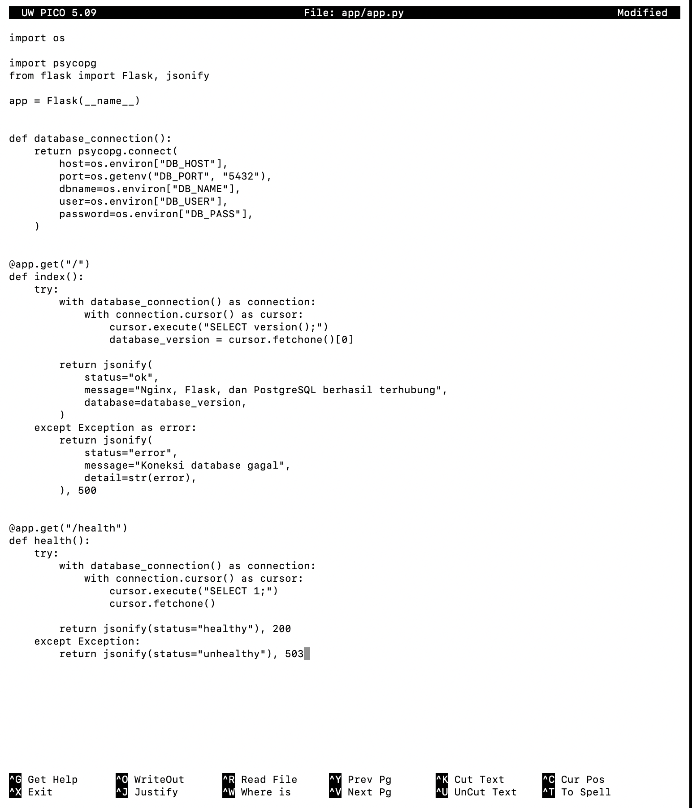

*Gambar 4. Isi file `app/app.py`.*

Pada endpoint `/`, aplikasi melakukan koneksi ke database PostgreSQL menggunakan konfigurasi yang diperoleh dari *environment variable*. Jika koneksi berhasil, aplikasi menampilkan status `ok` dan informasi versi PostgreSQL. Endpoint `/health` digunakan sebagai *health check* aplikasi untuk memastikan database dapat diakses dengan baik.

### 4.5 Membuat Dockerfile

Dockerfile digunakan untuk menentukan bagaimana image aplikasi Flask dibangun.

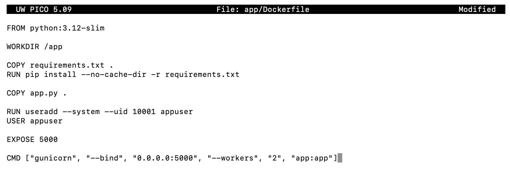

*Gambar 5. Isi file `app/Dockerfile`.*

Konfigurasi Dockerfile menggunakan Python 3.12 sebagai *base image* dan menginstal *dependency* dari `requirements.txt`.

### 4.6 Membuat Konfigurasi Nginx

File `nginx.conf` digunakan untuk mengatur Nginx sebagai *reverse proxy* menuju aplikasi Flask.

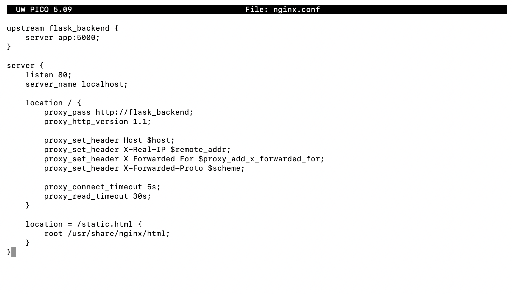

*Gambar 6. Isi file `nginx.conf`.*

Nginx meneruskan *request* yang diterima pada port 80 ke service `app` pada port 5000. Nama `app` merupakan nama service yang didefinisikan pada Docker Compose. Docker menyediakan DNS internal sehingga Nginx dapat menemukan container Flask menggunakan nama service tanpa harus mengetahui alamat IP container secara manual. Selain sebagai *reverse proxy*, Nginx juga digunakan untuk menyediakan halaman statis `static.html`.

### 4.7 Membuat Halaman HTML

Halaman HTML dibuat pada `nano html/index.html`. File ini berisi halaman sederhana untuk menguji penggunaan *bind mount* pada Nginx.

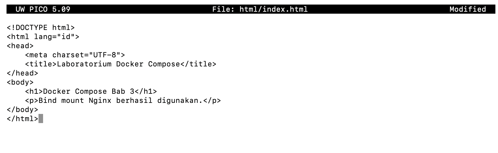

*Gambar 7. Isi file `html/index.html`.*

Folder `html` pada komputer di-*mount* ke direktori `/usr/share/nginx/html` di dalam container Nginx. Dengan demikian, file HTML pada host dapat digunakan langsung oleh container.

### 4.8 Validasi Konfigurasi Docker Compose

Sebelum menjalankan container, konfigurasi Docker Compose dicek dengan perintah berikut. Perintah tersebut digunakan untuk memastikan file YAML dapat diproses oleh Docker Compose dan tidak terdapat kesalahan sintaks atau indentasi.

```bash
docker compose config
```

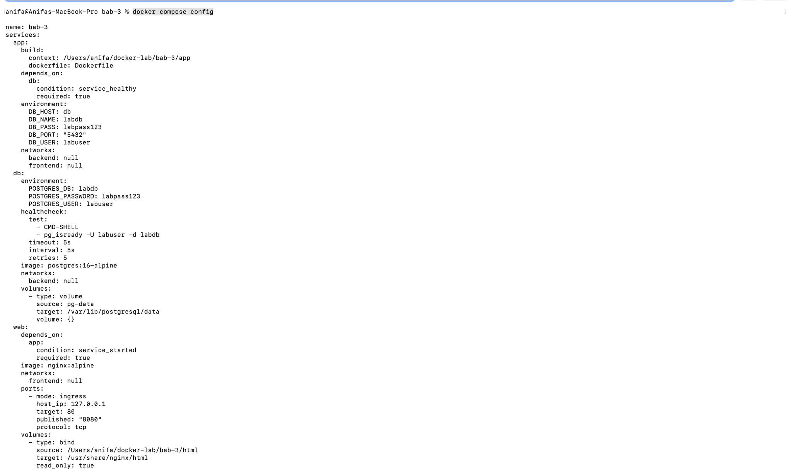

*Gambar 8. Hasil `docker compose config` (bagian 1).*

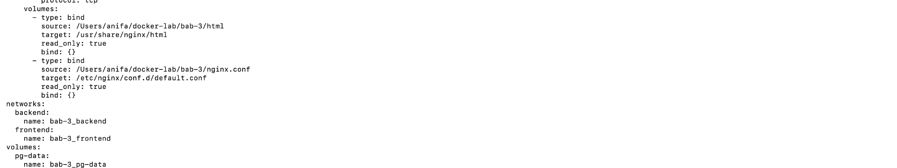

*Gambar 9. Hasil `docker compose config` (bagian 2).*

Selanjutnya dilakukan pengecekan service dengan perintah:

```bash
docker compose config --services
```

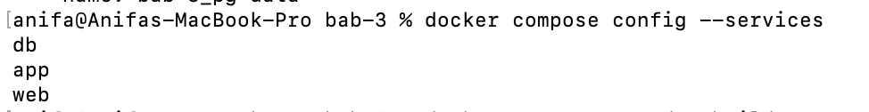

*Gambar 10. Daftar service pada konfigurasi Compose.*

### 4.9 Menjalankan Docker Compose

Setelah konfigurasi dinyatakan valid, seluruh service dijalankan menggunakan:

```bash
docker compose up -d --build
```

Parameter `-d` digunakan agar container berjalan di *background*, sedangkan `--build` digunakan untuk membangun kembali image aplikasi berdasarkan Dockerfile.

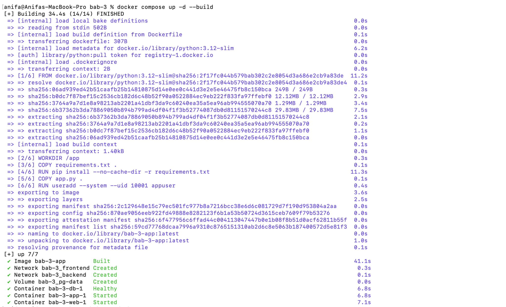

*Gambar 11. Proses build image dan penjalanan seluruh service.*

### 4.10 Memeriksa Status Container

```bash
docker compose ps
```

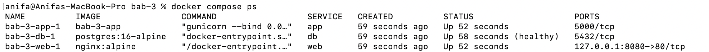

*Gambar 12. Status container hasil `docker compose ps`.*

Status `healthy` pada PostgreSQL menunjukkan bahwa *health check* database berhasil dilakukan.

### 4.11 Pengujian Aplikasi

Pengujian dilakukan menggunakan perintah berikut:

```bash
curl http://localhost:8080/
```

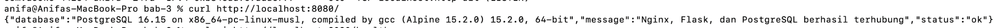

*Gambar 13. Hasil `curl` ke endpoint `/`.*

Request dikirim ke Nginx melalui port 8080. Nginx kemudian meneruskan request tersebut ke aplikasi Flask. Flask selanjutnya melakukan koneksi ke PostgreSQL. Keberhasilan *response* menunjukkan bahwa komunikasi antarservice berjalan dengan baik.

Uji *health endpoint*. Endpoint `/health` digunakan untuk memastikan aplikasi Flask dapat terhubung dengan database PostgreSQL.

```bash
curl -i http://localhost:8080/health
```

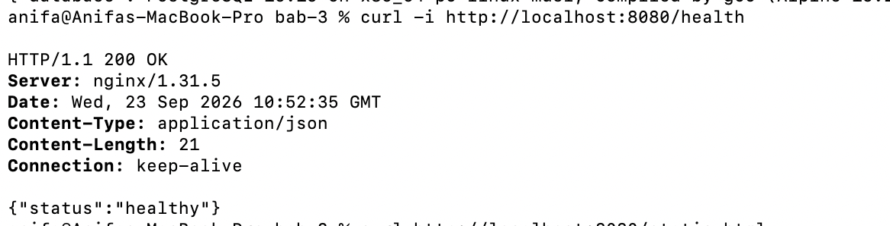

*Gambar 14. Hasil `curl -i` ke endpoint `/health`.*

Uji halaman statis:

```bash
curl http://localhost:8080/static.html
```

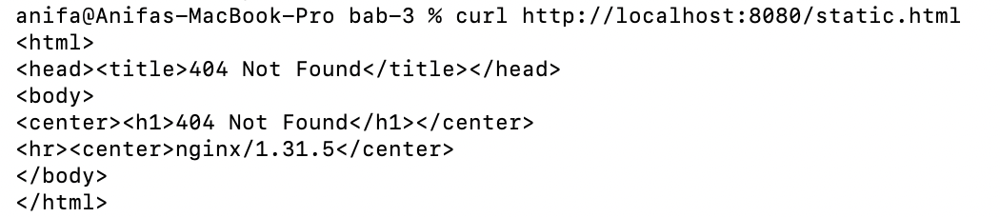

*Gambar 15. Hasil `curl` ke `/static.html`.*

### 4.12 Pemeriksaan Log

Log seluruh service diperiksa menggunakan perintah berikut. Perintah tersebut digunakan untuk melihat aktivitas dan kemungkinan *error* dari seluruh container. Log juga dapat digunakan untuk membantu mengetahui penyebab apabila aplikasi tidak dapat diakses.

```bash
docker compose logs --tail 100
```

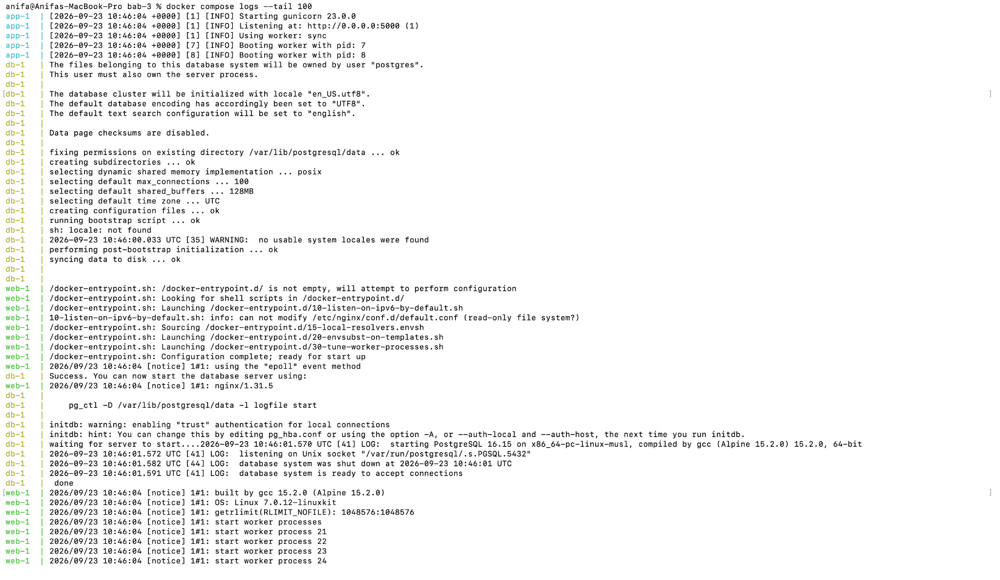

*Gambar 16. Log seluruh service.*

Pemeriksaan log berdasarkan service:

```bash
docker compose logs app
```

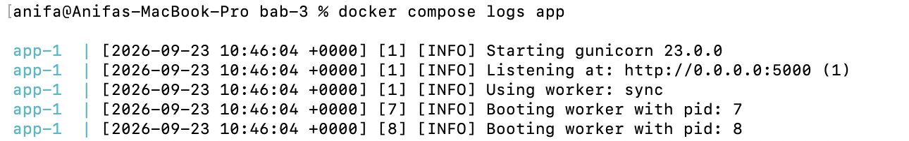

*Gambar 17. Log service `app`.*

```bash
docker compose logs db
```

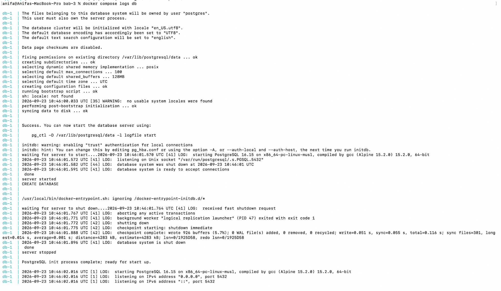

*Gambar 18. Log service `db`.*

```bash
docker compose log web
```

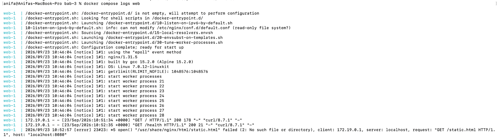

*Gambar 19. Log service `web`.*

### 4.12 Menghentikan Docker Compose

Menghentikan Docker menggunakan perintah berikut. Perintah tersebut menghentikan dan menghapus container serta network yang dibuat oleh Docker Compose. Volume PostgreSQL tetap dipertahankan sehingga data database tidak langsung terhapus.

```bash
docker compose down
```

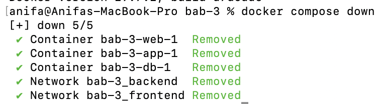

*Gambar 20. Hasil `docker compose down`.*

---

## 5. Hasil Pengujian

| Pemeriksaan | Hasil Aktual | Status |
| --- | --- | --- |
| `docker compose config` | Konfigurasi berhasil divalidasi tanpa error | Terpenuhi |
| `docker compose up -d --build` | Service `web`, `app`, dan `db` berhasil dijalankan | Terpenuhi |
| `docker compose ps` | Seluruh service berjalan dan `db` berstatus *healthy* | Terpenuhi |
| `docker network ls` | Network `frontend` dan `backend` berhasil dibuat | Terpenuhi |
| `docker ps` | Container berhasil berjalan | Terpenuhi |
| `curl http://localhost:8080/` | Flask berhasil terhubung dengan PostgreSQL | Terpenuhi |
| `curl -i http://localhost:8080/health` | Status aplikasi *healthy* | Terpenuhi |
| `curl http://localhost:8080/static.html` | Halaman statis berhasil diakses melalui Nginx | Terpenuhi |
| `ping` | Koneksi antarservice berhasil diuji | Terpenuhi |

---

## 6. Threat Statement

Aset yang dilindungi meliputi *source code* Flask, kredensial PostgreSQL, data database, dan container. Risiko yang diperhatikan adalah akses tidak sah, kebocoran kredensial, dan eksploitasi container. Mitigasi yang diterapkan adalah membatasi port Nginx ke `127.0.0.1`, menjalankan aplikasi menggunakan user *non-root* `appuser`, serta memisahkan network *frontend* dan *backend*. Kredensial database masih berada di `compose.yaml` sehingga konfigurasi ini ditujukan untuk lingkungan praktikum.

---

## 7. Analisis

Docker Compose berhasil menjalankan tiga service, yaitu Nginx, Flask, dan PostgreSQL. Network *frontend* digunakan untuk komunikasi Nginx dengan Flask, sedangkan network *backend* digunakan untuk komunikasi Flask dengan PostgreSQL. *Health check* PostgreSQL juga berhasil diterapkan sehingga aplikasi Flask dapat terhubung setelah database dalam kondisi sehat. Pengujian endpoint `/`, `/health`, dan `/static.html` berhasil dilakukan.

---

## 8. Tindak Lanjut

1. Menggunakan Docker Secret untuk menyimpan kredensial database.
2. Melakukan backup dan restore database secara berkala.
3. Menambahkan *resource limit* dan *logging*.
4. Menggunakan HTTPS apabila aplikasi diakses dari luar host.

---

## 9. Kesimpulan

Praktikum Bab 3 berhasil mengimplementasikan Docker Compose dengan tiga service, yaitu Nginx, Flask, dan PostgreSQL. Seluruh service berhasil berjalan dan saling terhubung. Pengujian endpoint `/`, `/health`, dan `/static.html` berhasil dilakukan. Penerapan keamanan berupa pembatasan port ke `127.0.0.1`, penggunaan user *non-root*, serta pemisahan network *frontend* dan *backend* juga berhasil diterapkan.

---

## 10. Referensi

Ferry Astika Saputra, *Bab 3 — Docker Network, Volume, Bind Mount, tmpfs, dan Compose*, Repository DevSecOps PENS, diakses pada 23 September 2026.
