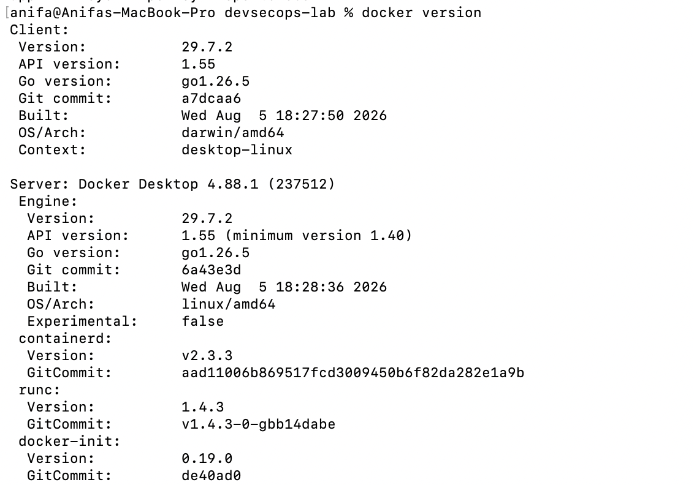
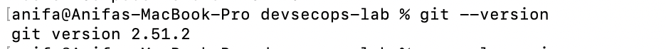
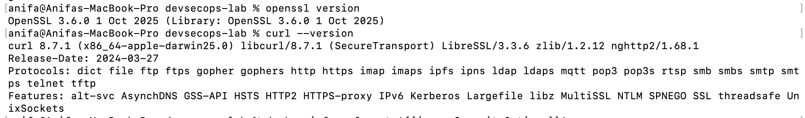
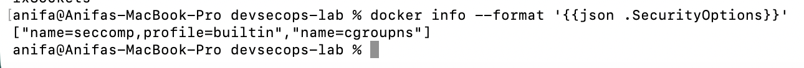

# Bab 1: Fondasi Teoretis dan Kerangka Kerja DevSecOps

**Praktikum 1 - Menetapkan Baseline Laboratorium**

Disusun untuk memenuhi Mata Kuliah Workshop DevOps

Dosen Pengampu : Dr.Ferry Astika Saputra,ST, M.Sc

Oleh :

Nama : Anifa Aulia Abdari

NRP : 3126640053

Kelas : B - StrLJ D4 Teknik Informatika

Politeknik Elektronika Negeri Surabaya

Departemen Teknik Informatika dan Komputer

Program Studi Teknik Informatika

#### Langkah - langkah Instalasi

1.  Instalasi Homebrew pada macOS

Menambahkan path Homebrew dan memastikan apakah Homebrew sudah terinstal

2.  Install Docker Desktop

> {width="5.415625546806649in"
> height="2.493918416447944in"}
>
> Tampilan apabila Docker berhasil diinstal
>
> 

3.  Verifikasi/install Xcode Command Line Tools

> {width="6.436458880139982in"
> height="1.5190430883639545in"}

**B. Menjalankan Baseline Praktikum 1**

1.  Pastikan bahwa Docker sudah running, dengan command *open
    > /Applications/Docker.app*

2.  Membuat folder kerja

> {width="5.832292213473316in"
> height="0.8029330708661417in"}

3.  Mengecek versi Docker dengan menjalankan command *docker version*

> {width="4.446875546806649in"
> height="3.1145428696412947in"}

4.  Mengecek docker compose dengan menjalankan command *docker compose
    > version*

> {width="6.291666666666667in"
> height="0.4080216535433071in"}

5.  Mengecek versi git dengan menjalankan command *git \--version*

> {width="5.84375in"
> height="0.39568241469816273in"}

6.  Mengecek versi OpenSSL dengan menjalankan command *openssl version*

> {width="6.681222659667542in"
> height="0.9804516622922135in"}

7.  Mengecek versi curl dengan menjalankan command *curl \--version*

> {width="6.478125546806649in"
> height="0.7546380139982503in"}

8.  Mengecek SecurityOptions Docker dengan menjalankan command *docker
    > info \--format \'{{json
    > .SecurityOptions}}\'*{width="6.496863517060367in"
    > height="0.5504155730533683in"}

> Aset yang dilindungi adalah *Docker daemon, image* dan *container*
> yang dibangun, serta direktori kerja *reports, sbom, dan keys* yang
> menyimpan hasil pemindaian dan material kriptografi. Aktor ancaman
> yang relevan mencakup pengguna internal yang tidak sengaja memberikan
> akses berlebih pada *Docker socket* maupun pihak eksternal yang
> memanfaatkan kerentanan pada *image container*. Jalur serangan yang
> mungkin terjadi meliputi akses tidak sah ke *Docker socket* akibat
> permission yang longgar, penggunaan image dengan dependency yang
> memiliki celah keamanan (CVE), atau kebocoran *secret* dari folder
> keys bila tidak dijaga dengan baik. Apabila hal tersebut terjadi,
> dampaknya dapat berupa eskalasi hak akses ke level host, kebocoran
> data sensitif, hingga rusaknya integritas proses delivery software.

**C. Evaluasi dan Latihan Mandiri**

1.  Mengapa DevSecOps tidak dapat direduksi menjadi penambahan scanner
    > pada pipeline?

> DevSecOps tidak bisa disederhanakan menjadi sekadar penambahan
> scanner, karena scanner hanyalah alat, bukan solusi menyeluruh. Tanpa
> perubahan proses kerja, temuan kerentanan hanya akan menumpuk tanpa
> ada yang menindaklanjuti dan keamanan tetap dianggap tanggung jawab
> tim security saja. DevSecOps yang efektif membutuhkan perubahan pada
> empat aspek sekaligus: teknologi (tooling), proses (tindak lanjut
> hasil scan), tata kelola (kewenangan approve/reject), dan budaya kerja
> (tanggung jawab bersama).

2.  Evidence apa yang membedakan klaim kontrol dari kontrol yang
    > benar-benar terverifikasi?

> Klaim kontrol hanya berupa pernyataan tanpa bukti, misalnya asumsi
> "sudah aman karena pakai container". Kontrol terverifikasi didukung
> evidence konkret seperti hasil scan dengan timestamp, versi tool dan
> database vulnerability yang digunakan, konfigurasi keamanan yang
> benar-benar diperiksa (bukan diasumsikan), serta SBOM yang mencatat
> seluruh dependency. Intinya, evidence yang sah harus reproducible dan
> bisa diverifikasi ulang oleh pihak lain.

3.  Bagaimana shared responsibility memengaruhi ownership risiko dan
    > tindak lanjut temuan?

> Shared responsibility membagi tanggung jawab keamanan antara
> developer, tim operasional, tim security, dan penyedia platform.
> Developer bertanggung jawab atas kerentanan di kodenya, operasional
> atas konfigurasi infrastruktur, dan security atas kebijakan serta
> validasi akhir. Tanpa pembagian yang jelas, temuan scan hanya menumpuk
> tanpa tindak lanjut. Dengan ownership yang jelas, setiap temuan bisa
> ditangani sesuai dengan pihak yang berwenang, misalnya, developer
> memperbaiki kerentanan kritis dalam batas waktu tertentu.
